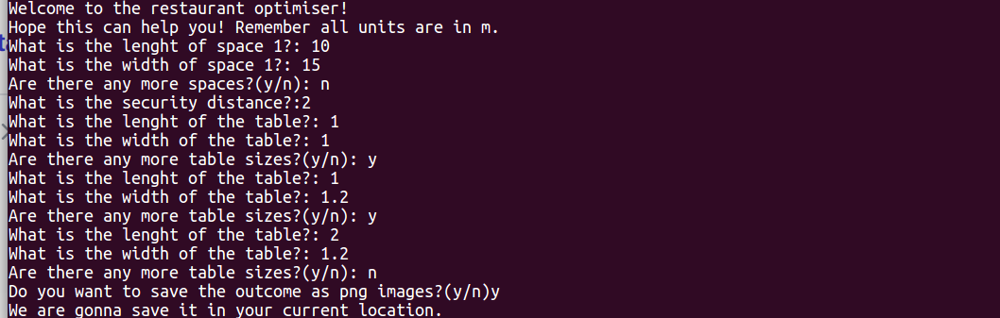

# Restaurant optimisation

This repository contains a script which will compute the optimal table distribution in a restaurant.

## How to use

In order to run the program, you should have Python3.7 (or more) installed. 

The following steps will allow you run the script:

* Clone the respository
* `cd` into the repository location from the terminal
* Type `pip install -r requirements.txt` in the terminal
* Type `python3 optimizer/table_organizer.py

An example on how this will look like:

